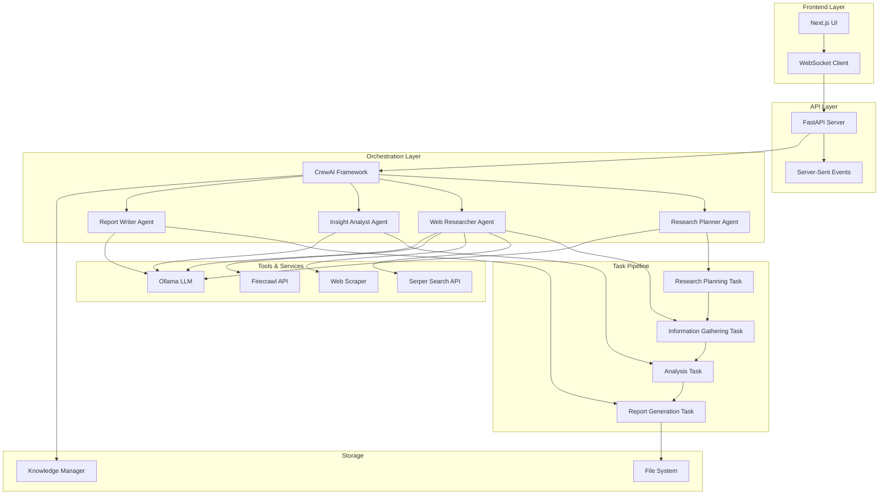
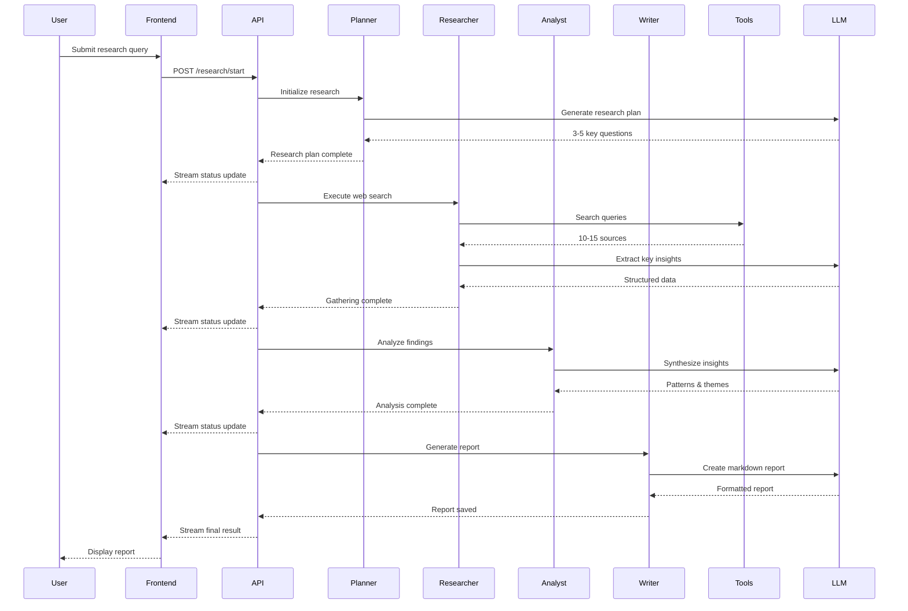

# Deep Research Agent

A streamlined AI-powered research system that performs comprehensive topic research in 5-10 minutes, similar to Gemini Deep Research and GPT Deep Research. Built with CrewAI and Next.js.

## High-Level Architecture



## System Flow



## Features

- **Fast Execution**: Complete research in 5-10 minutes
- **Streamlined Workflow**: 4-agent, 4-task linear pipeline
- **Web Intelligence**: Automated search and scraping from multiple sources
- **Real-time Updates**: Live progress streaming via Server-Sent Events
- **Professional Reports**: Markdown-formatted research reports with citations
- **Local LLM Support**: Works with Ollama for privacy and cost control
- **Knowledge Management**: Persistent knowledge base across sessions

## Technology Stack

### Backend
- **Framework**: CrewAI 1.6.0
- **API**: FastAPI + Uvicorn
- **LLM**: Ollama (local) or OpenAI-compatible APIs
- **Web Scraping**: Serper Search API, BeautifulSoup4, Firecrawl
- **Document Processing**: PyMuPDF, Python-dateutil

### Frontend
- **Framework**: Next.js 16.0.5
- **UI**: React 19.2.0, TailwindCSS 4
- **Markdown**: react-markdown with remark-gfm
- **Communication**: Server-Sent Events (SSE)

## Installation

### Prerequisites

- Python 3.10-3.13
- Node.js 18+ and npm
- Ollama (for local LLM) or OpenAI API key
- Serper API key (for web search)

### Backend Setup

1. Clone the repository:
```bash
git clone https://github.com/saquibjawedbit/Deep-Research-Agent.git
cd Deep-Research-Agent
```

2. Navigate to backend directory:
```bash
cd crew_ai
```

3. Install Python dependencies using uv:
```bash
# Install uv if not already installed
curl -LsSf https://astral.sh/uv/install.sh | sh

# Install project dependencies
uv sync
```

4. Configure environment variables:
```bash
cp .env.example .env
# Edit .env with your settings
```

Required environment variables:
```bash
# For Ollama (local)
OPENAI_API_KEY=ollama
OPENAI_API_BASE=http://localhost:11434/v1
OPENAI_MODEL_NAME=gpt-oss:120b-cloud

# For OpenAI (cloud)
# OPENAI_API_KEY=your_openai_api_key
# OPENAI_MODEL_NAME=gpt-4

# Required: Serper Search API
SERPER_API_KEY=your_serper_api_key

# Optional: Firecrawl API
FIRECRAWL_API_KEY=your_firecrawl_api_key
```

5. Start Ollama (if using local LLM):
```bash
ollama serve
# In another terminal, pull the model
ollama pull gpt-oss:120b-cloud
```

### Frontend Setup

1. Navigate to frontend directory:
```bash
cd ../frontend
```

2. Install dependencies:
```bash
npm install
```

3. Start development server:
```bash
npm run dev
```

The frontend will be available at `http://localhost:3000`

### Running the Application

#### Option 1: API Server (for frontend integration)

```bash
cd crew_ai
uv run server
```

The API will be available at:
- Server: `http://localhost:8000`
- Swagger UI: `http://localhost:8000/docs`
- ReDoc: `http://localhost:8000/redoc`

#### Option 2: CLI Mode (direct execution)

```bash
cd crew_ai
uv run latest_ai_development
```

## API Endpoints

### POST /research/start
Start a new research task with streaming updates.

**Request Body:**
```json
{
  "query": "efficacy of transformer models for NLP",
  "start_date": "2020-01-01",
  "end_date": "2024-12-31",
  "sources": "papers, web",
  "max_docs": 15,
  "depth_level": 3
}
```

**Response:** Server-Sent Events stream with status updates

### GET /health
Health check endpoint.

## Configuration

### Research Parameters

- `query` (string): Research topic or question
- `start_date` (string): Start date for sources (YYYY-MM-DD)
- `end_date` (string): End date for sources (YYYY-MM-DD)
- `sources` (string): Source types (papers, web, etc.)
- `max_docs` (int): Maximum sources to gather (default: 15)
- `depth_level` (int): Research depth 1-5 (default: 3)

### Agent Configuration

Edit `crew_ai/src/latest_ai_development/config/agents.yaml` to customize agent behavior.

### Task Configuration

Edit `crew_ai/src/latest_ai_development/config/tasks.yaml` to customize task execution.

## Project Structure

```
Deep-Research-Agent/
├── crew_ai/                          # Backend application
│   ├── src/
│   │   └── latest_ai_development/
│   │       ├── config/               # Agent and task configurations
│   │       │   ├── agents.yaml
│   │       │   └── tasks.yaml
│   │       ├── tools/                # Research tools
│   │       │   ├── ingestion/        # Web scraping and search
│   │       │   ├── analysis/         # Data analysis tools
│   │       │   └── output/           # Report generation
│   │       ├── models/               # Data models
│   │       ├── utils/                # Utilities
│   │       ├── crew.py               # CrewAI orchestration
│   │       ├── api.py                # FastAPI server
│   │       ├── main.py               # CLI entry point
│   │       └── schemas.py            # Pydantic schemas
│   ├── pyproject.toml                # Python dependencies
│   └── .env                          # Environment configuration
│
├── frontend/                         # Next.js frontend
│   ├── app/                          # Next.js app directory
│   │   ├── page.tsx                  # Main UI component
│   │   ├── layout.tsx                # App layout
│   │   └── globals.css               # Global styles
│   ├── package.json                  # Node dependencies
│   └── tsconfig.json                 # TypeScript config
│
└── README.md                         # This file
```

## Development

### Backend Development

```bash
cd crew_ai
# Run with auto-reload
uv run server
```

### Frontend Development

```bash
cd frontend
npm run dev
```

### Testing

```bash
cd crew_ai
# Run tests
uv run pytest

# Test specific crew
uv run test 3 gpt-4
```

## Output

Research reports are generated in Markdown format and saved to `research_report.md` with the following structure:

1. **Executive Summary**: Overview and key findings
2. **Research Questions & Answers**: Detailed responses with citations
3. **Key Insights & Analysis**: Themes, patterns, and trends
4. **Sources**: Full bibliography with URLs and credibility notes

## Troubleshooting

### Ollama Connection Issues

Ensure Ollama is running and the model is available:
```bash
ollama list
curl http://localhost:11434/api/tags
```

### API Key Errors

Verify all required API keys are set in `.env`:
- `OPENAI_API_KEY` (set to "ollama" for local LLM)
- `SERPER_API_KEY` (required for web search)

### Port Conflicts

If port 8000 or 3000 is in use, change in:
- Backend: `crew_ai/src/latest_ai_development/main.py` (uvicorn port)
- Frontend: `frontend/package.json` (next dev port)

## Performance

- **Execution Time**: 5-10 minutes for standard research (depth_level 3)
- **Source Coverage**: 10-15 high-quality sources per query
- **Context Management**: Optimized to prevent overflow with minimal dependencies

## Contributing

Contributions are welcome! Please follow these guidelines:

1. Fork the repository
2. Create a feature branch
3. Make your changes
4. Submit a pull request

## License

MIT License - see LICENSE file for details

## Acknowledgments

- Built with [CrewAI](https://github.com/joaomdmoura/crewAI)
- Powered by [Ollama](https://ollama.ai/) for local LLM inference
- Search powered by [Serper API](https://serper.dev/)
- Inspired by Gemini Deep Research and GPT Deep Research

## Support

For issues, questions, or contributions:
- GitHub Issues: [Create an issue](https://github.com/saquibjawedbit/Deep-Research-Agent/issues)
- Documentation: See `crew_ai/DEEP_RESEARCH_CREW_PLAN.md`
