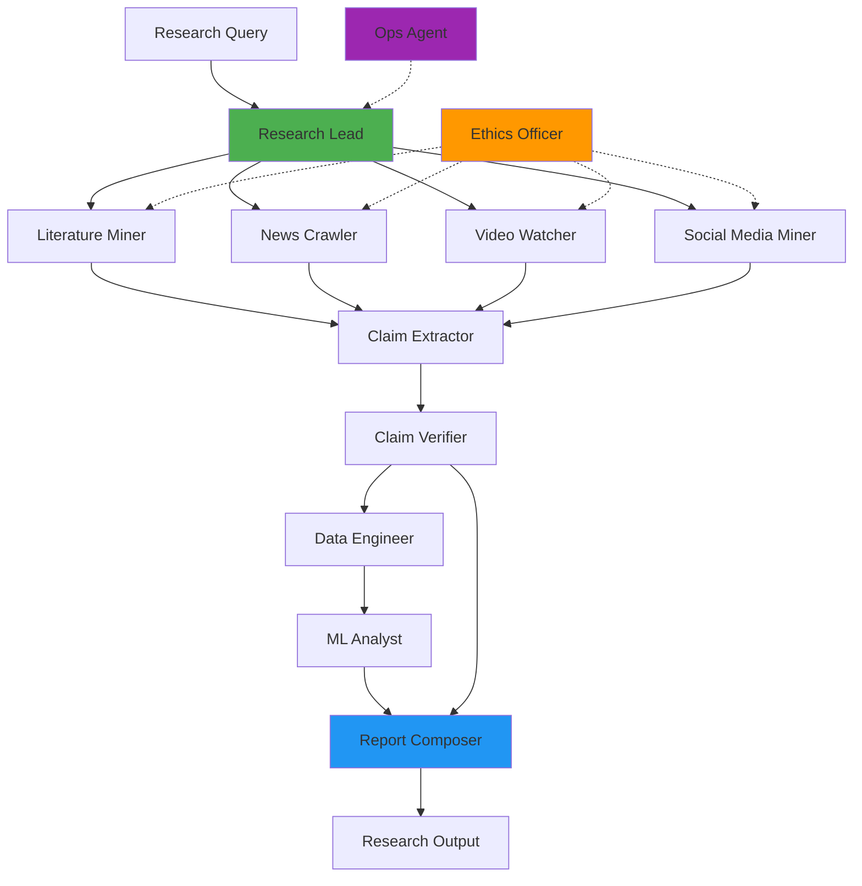

# Deep Research Crew — Implementation Plan

## Overview

This plan outlines the implementation of a comprehensive **Deep Research Crew** system using CrewAI. The system will perform end-to-end evidence-driven research across multiple modalities (papers, datasets, videos, social media, news) and produce reproducible, auditable research outputs with provenance tracking.

---

## User Review Required

> [!IMPORTANT]
> **Scope Decision Required**: This is a large-scale system with 11 agents and extensive tooling. We recommend implementing in phases:
> - **Phase 1 (MVP)**: Core 4 agents (Research Lead, Literature Miner, Claim Verifier, Report Composer) + basic PDF/web tools
> - **Phase 2**: Add data analysis capabilities (Data Engineer, ML Analyst)
> - **Phase 3**: Add multimodal capabilities (Video Watcher, Social Media Miner, News Crawler)
> - **Phase 4**: Add governance (Ethics Officer, Ops Agent)
>
> **Please confirm which phase(s) you'd like to implement now.**

> [!WARNING]
> **External API Dependencies**: Many tools require API keys and subscriptions:
> - OpenAI API (for embeddings and LLM calls)
> - YouTube Data API (for video metadata)
> - Social media APIs (X/Twitter, Reddit, etc.)
> - Search APIs (Google Custom Search or Bing)
> - Semantic Scholar, Crossref (free but rate-limited)
>
> **Please confirm which APIs you have access to or want to use.**

> [!CAUTION]
> **Legal & Ethical Considerations**: Web scraping and social media mining have legal implications:
> - Must respect robots.txt and Terms of Service
> - Need proper rate limiting and politeness policies
> - PII handling and data retention policies required
> - Some platforms prohibit automated scraping
>
> **The Ethics Officer agent will flag issues, but you need to establish policies upfront.**

---

## Proposed Changes

### Core Infrastructure

#### [NEW] tools/ directory

Create a new directory structure for custom tools:

```
tools/
├── __init__.py
├── base.py                    # Base tool classes
├── ingestion/
│   ├── __init__.py
│   ├── pdf_parser.py         # PDF parsing with GROBID/PyMuPDF
│   ├── video_processor.py    # Video download + transcription
│   ├── web_scraper.py        # Playwright-based scraper
│   ├── news_crawler.py       # News/RSS aggregation
│   └── social_miner.py       # Social media APIs
├── analysis/
│   ├── __init__.py
│   ├── claim_extractor.py    # Extract claims from text
│   ├── fact_checker.py       # Verify claims against datasets
│   ├── data_analyzer.py      # Pandas/statistical analysis
│   └── sentiment_analyzer.py # Sentiment & social analysis
└── output/
    ├── __init__.py
    ├── report_generator.py   # Markdown report generation
    ├── notebook_generator.py # Jupyter notebook creation
    └── provenance_graph.py   # Graph visualization
```

#### [NEW] models/ directory

Pydantic models for structured data:

```
models/
├── __init__.py
├── claim.py          # Claim, Evidence, Provenance models
├── research.py       # ResearchQuery, ResearchResult models
├── document.py       # Document, Section, Citation models
└── analysis.py       # AnalysisResult, Visualization models
```

#### [NEW] utils/ directory

Utility functions and helpers:

```
utils/
├── __init__.py
├── config.py         # Configuration management
├── storage.py        # S3/blob storage helpers
├── embeddings.py     # Embedding generation
└── validators.py     # Input validation
```

---

### Agent Definitions

#### [MODIFY] config/agents.yaml

Replace existing agents with 11 specialized research agents. Each agent will have:
- Detailed role and backstory (as specified in the design doc)
- Specific tools assigned based on their responsibilities
- Clear goals and capabilities

**Phase 1 MVP Agents** (4 agents):
1. `research_lead` - Orchestrator with planning and synthesis capabilities
2. `literature_miner` - PDF/HTML parsing, citation extraction, claim identification
3. `claim_verifier` - Fact-checking, dataset queries, confidence scoring
4. `report_composer` - Report generation, visualization, provenance graphs

**Phase 2 Agents** (2 agents):
5. `data_engineer` - Data ingestion, normalization, storage
6. `ml_analyst` - EDA, modeling, pattern discovery

**Phase 3 Agents** (3 agents):
7. `social_media_miner` - Social platform monitoring, sentiment, influence
8. `video_watcher` - Video transcription, timestamp extraction
9. `news_crawler` - Large-scale news/blog scraping

**Phase 4 Agents** (2 agents):
10. `ethics_officer` - Privacy, legal compliance, PII detection
11. `ops_agent` - Deployment, monitoring, cost control

#### [MODIFY] config/tasks.yaml

Define task workflows for deep research:

**Phase 1 MVP Tasks**:
- `discovery_task` - Initial query understanding and source identification
- `literature_mining_task` - PDF/web content extraction and parsing
- `claim_extraction_task` - Identify and structure claims with provenance
- `fact_checking_task` - Verify claims against available data
- `synthesis_task` - Combine findings into coherent narrative
- `report_generation_task` - Create final research packet

**Later Phase Tasks**:
- `data_ingestion_task` - ETL for datasets
- `analysis_task` - Statistical and ML analysis
- `social_monitoring_task` - Track social signals
- `video_analysis_task` - Process video content
- `ethics_review_task` - Compliance and privacy checks

---

### Tool Implementation

#### [NEW] tools/ingestion/pdf_parser.py

PDF parsing tool using PyMuPDF and optional GROBID:
- Extract text with positional information
- Parse sections (abstract, methods, results, references)
- Extract tables and figures
- Identify citations and datasets mentioned
- Return structured `Document` model

**Dependencies**: `pymupdf`, `pdfplumber`, optional `grobid-client`

#### [NEW] tools/analysis/claim_extractor.py

Claim extraction using LLM-based parsing:
- Identify factual claims in text
- Extract numerical assertions with context
- Link claims to source locations (page, paragraph)
- Classify claim types (experimental, theoretical, comparative)
- Return `Claim` objects with provenance

**Dependencies**: LLM API access, `spacy` for NER

#### [NEW] tools/analysis/fact_checker.py

Fact-checking tool with multiple verification strategies:
- Search academic databases (Semantic Scholar, Crossref)
- Query public datasets (if claim references data)
- Cross-reference with other papers
- Assign confidence scores (verified/contradicted/unknown)
- Generate verification report with evidence

**Dependencies**: API clients for Semantic Scholar, Crossref, optional dataset access

#### [NEW] tools/ingestion/web_scraper.py

Playwright-based web scraping:
- Handle JavaScript-heavy sites
- Respect robots.txt and rate limits
- Extract clean text from HTML
- Handle pagination and dynamic loading
- Return structured content

**Dependencies**: `playwright`, `beautifulsoup4`, `newspaper3k`

#### [NEW] tools/output/report_generator.py

Research report generation:
- Executive summary with key findings
- Detailed claim-by-claim analysis
- Confidence scores and evidence links
- Provenance graph visualization
- Export as Markdown with embedded assets

**Dependencies**: `jinja2` for templates, `matplotlib`/`plotly` for visualizations

---

### Crew Configuration

#### [MODIFY] crew.py

Update crew class to support:
- Dynamic agent loading based on phase/configuration
- Tool assignment per agent
- Sequential and hierarchical process modes
- Callback hooks for monitoring
- Output validation and storage

Key changes:
- Add tool imports and initialization
- Create agent factory methods for all 11 agents
- Define task dependencies and workflows
- Add `@before_kickoff` hook for setup
- Add `@after_kickoff` hook for cleanup and archival

#### [MODIFY] main.py

Update entry point to support:
- Rich input schema (query, sources, date ranges, reproduce flag)
- API-style kickoff with JSON payloads
- Progress tracking and status endpoints
- Result packaging and export

---

### Dependencies

#### [MODIFY] pyproject.toml

Add required dependencies:

```toml
dependencies = [
    "crewai[tools]==1.6.0",
    
    # Core
    "pydantic>=2.0.0",
    "python-dotenv>=1.0.0",
    
    # Document Processing
    "pymupdf>=1.23.0",
    "pdfplumber>=0.10.0",
    "beautifulsoup4>=4.12.0",
    "newspaper3k>=0.2.8",
    
    # Web Scraping
    "playwright>=1.40.0",
    "requests>=2.31.0",
    
    # NLP & Analysis
    "spacy>=3.7.0",
    "transformers>=4.35.0",
    "sentence-transformers>=2.2.0",
    
    # Data Processing
    "pandas>=2.1.0",
    "polars>=0.19.0",
    "scikit-learn>=1.3.0",
    
    # Visualization
    "matplotlib>=3.8.0",
    "plotly>=5.18.0",
    "networkx>=3.2.0",
    
    # APIs
    "openai>=1.3.0",
    "anthropic>=0.7.0",
    
    # Storage & Databases
    "boto3>=1.29.0",  # S3
    "redis>=5.0.0",
    
    # Utilities
    "jinja2>=3.1.0",
    "python-dateutil>=2.8.0",
    "tqdm>=4.66.0",
]
```

---

### Configuration

#### [NEW] .env.example

Template for environment variables:

```bash
# LLM APIs
OPENAI_API_KEY=your_key_here
ANTHROPIC_API_KEY=your_key_here

# Search & Academic APIs
SEMANTIC_SCHOLAR_API_KEY=optional
CROSSREF_EMAIL=your_email@example.com

# Social Media APIs (Phase 3)
TWITTER_BEARER_TOKEN=your_token_here
REDDIT_CLIENT_ID=your_client_id
REDDIT_CLIENT_SECRET=your_secret

# YouTube (Phase 3)
YOUTUBE_API_KEY=your_key_here

# Storage
AWS_ACCESS_KEY_ID=your_key
AWS_SECRET_ACCESS_KEY=your_secret
S3_BUCKET_NAME=research-artifacts

# Optional: Vector DB
PINECONE_API_KEY=your_key
PINECONE_ENVIRONMENT=your_env
```

---

## Data Flow Architecture



---

## Verification Plan

### Automated Tests

#### Unit Tests
Create `tests/tools/` directory with tests for each tool:

```bash
# Run unit tests
pytest tests/tools/test_pdf_parser.py -v
pytest tests/tools/test_claim_extractor.py -v
pytest tests/tools/test_fact_checker.py -v
```

**Test coverage**:
- PDF parsing with sample academic papers
- Claim extraction from known text
- Fact-checking with mock API responses
- Report generation with sample data

#### Integration Tests
Create `tests/integration/` for end-to-end workflows:

```bash
# Run integration test with sample research query
pytest tests/integration/test_research_workflow.py -v
```

**Test scenario**: 
- Input: "Efficacy of transformer models for NLP tasks"
- Expected: Research report with claims, verification, and provenance
- Validation: Check output structure, claim count, confidence scores

### Manual Verification

#### Phase 1 MVP Test
1. Set up environment variables in `.env`
2. Install dependencies: `pip install -e .`
3. Run sample research query:
   ```bash
   python -m latest_ai_development.main
   ```
4. Verify outputs:
   - `report.md` contains structured findings
   - Claims have provenance links
   - Confidence scores are reasonable
   - No PII or sensitive data exposed

#### Tool-Specific Tests
1. **PDF Parser**: Test with sample academic paper PDF
   - Verify section extraction (abstract, methods, results)
   - Check citation parsing accuracy
   
2. **Claim Extractor**: Test with known text containing claims
   - Verify claim identification
   - Check provenance linking
   
3. **Fact Checker**: Test with verifiable claim
   - Verify API calls to Semantic Scholar
   - Check confidence scoring logic

### Performance Benchmarks
- PDF processing: < 30 seconds per paper
- Claim extraction: < 10 seconds per document
- Fact-checking: < 5 seconds per claim (with caching)
- Full research workflow: < 5 minutes for 10 sources

---

## Phased Rollout

### Phase 1: MVP (Week 1-2)
**Goal**: Working research system with core agents and PDF/web capabilities

**Deliverables**:
- 4 core agents (Research Lead, Literature Miner, Claim Verifier, Report Composer)
- PDF parsing and web scraping tools
- Basic claim extraction and verification
- Markdown report generation
- Unit and integration tests

**Success Criteria**:
- Can process academic papers and extract claims
- Can verify claims against Semantic Scholar
- Generates readable research report

### Phase 2: Data Analysis (Week 3)
**Goal**: Add data engineering and ML analysis capabilities

**Deliverables**:
- Data Engineer and ML Analyst agents
- Dataset ingestion and normalization tools
- Statistical analysis and visualization tools
- Reproducible notebook generation

**Success Criteria**:
- Can ingest and analyze CSV/JSON datasets
- Generates exploratory data analysis notebooks
- Produces visualizations for claims

### Phase 3: Multimodal (Week 4-5)
**Goal**: Add video, social media, and news capabilities

**Deliverables**:
- Video Watcher, Social Media Miner, News Crawler agents
- Video transcription and timestamp tools
- Social media API integrations
- Large-scale news scraping

**Success Criteria**:
- Can process YouTube videos and extract claims
- Can track social media mentions and sentiment
- Can aggregate news coverage at scale

### Phase 4: Governance (Week 6)
**Goal**: Add ethics, privacy, and operational controls

**Deliverables**:
- Ethics Officer and Ops Agent
- PII detection and redaction
- Rate limiting and cost controls
- Compliance monitoring

**Success Criteria**:
- Flags PII exposure automatically
- Respects rate limits and TOS
- Tracks costs and resource usage

---

## Cost Estimates

### API Costs (per research query)
- **LLM calls** (GPT-4 for synthesis): ~$0.50-2.00
- **Embeddings** (for 100 documents): ~$0.10
- **Search APIs** (10 queries): ~$0.05
- **Video transcription** (1 hour): ~$0.36 (Whisper API)

**Total per query**: ~$1-5 depending on scope

### Infrastructure (monthly, if self-hosted)
- **Vector DB** (Pinecone free tier or self-hosted Qdrant): $0-70
- **Storage** (S3 for artifacts): ~$5-20
- **Compute** (if running workers): $20-100

**Recommendation**: Start with free tiers and API-based services, scale to self-hosted as needed.

---

## Security & Privacy

### Data Handling
- Store raw artifacts in encrypted S3 buckets
- Hash PII before storage
- Implement data retention policies (30-90 days)
- Support opt-out requests

### API Security
- Store credentials in `.env` (never commit)
- Use rate limiting for all external APIs
- Implement retry logic with exponential backoff
- Log all API calls for audit

### Compliance
- Respect robots.txt for all web scraping
- Check Terms of Service before using APIs
- Implement politeness delays (1-2 seconds between requests)
- Flag legally sensitive content for human review

---

## Next Steps

1. **User Approval**: Review this plan and confirm:
   - Which phase to start with (recommend Phase 1 MVP)
   - Which APIs you have access to
   - Any specific requirements or constraints

2. **Environment Setup**: 
   - Create `.env` file with API keys
   - Confirm Python version (3.10-3.13)

3. **Implementation**: 
   - Start with Phase 1 core infrastructure
   - Build and test tools incrementally
   - Validate with sample research queries

4. **Iteration**:
   - Gather feedback on MVP
   - Refine agents and tools
   - Expand to additional phases

---

## Questions for User

1. **Scope**: Do you want to start with Phase 1 MVP (4 agents, PDF/web only) or implement more phases upfront?

2. **APIs**: Which external APIs do you have access to or want to use?
   - OpenAI/Anthropic for LLMs?
   - Semantic Scholar, Crossref for academic search?
   - YouTube, social media APIs?

3. **Storage**: Do you have S3 or prefer local file storage for artifacts?

4. **Domain**: Is there a specific research domain you want to focus on (e.g., ML/AI, medicine, climate)?

5. **Deployment**: Will this run locally, or do you need Docker/K8s deployment configs?
